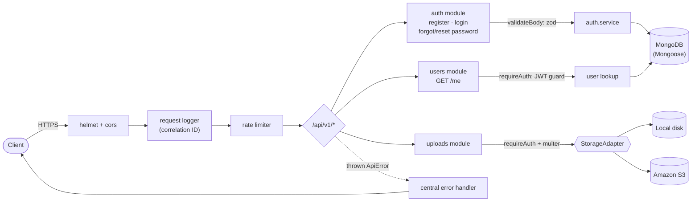

# TrustLayer API

Secure Express API with JWT auth, validation, rate limiting, uploads, and OpenAPI docs.

TrustLayer API is a reference backend that demonstrates how Webvoltz builds secure, production-shaped
Node.js services: typed request validation, JWT authentication, brute-force-resistant rate limiting, a
pluggable file-upload adapter, structured logs with request correlation IDs, and OpenAPI documentation -
all backed by an automated test suite. Built on Express 5, Mongoose 9, and Zod 4, kept current with
zero open `npm audit` advisories.

## Architecture



Requests flow through a fixed middleware pipeline (security headers → structured logging → rate
limiting → routing) before reaching a module. Each module keeps its `routes` → `controller` →
`service` layers separate, so validation, auth, and persistence concerns never mix. Every error -
expected (`ApiError`) or not - passes through one central handler that logs it and returns a
consistent, non-leaky JSON shape.

## Security features

- **JWT authentication** - short-lived, signed access tokens (`requireAuth` middleware), verified
  with an explicit issuer check.
- **Request validation** - every mutating endpoint validates its body against a
  [zod](https://zod.dev) schema before touching a controller; failures return `422` with field-level
  detail, never a stack trace.
- **Rate limiting** - a general API limiter plus a stricter, failure-only limiter on the auth
  endpoints (`/register`, `/login`, `/forgot-password`, `/reset-password`) to blunt credential
  stuffing and brute-force attempts.
- **Password handling** - bcrypt hashing via `bcryptjs` (12 salt rounds), and reset tokens that are
  single-use, time-limited, and stored only as a SHA-256 hash - never in plaintext.
- **Account-enumeration resistance** - `/forgot-password` responds identically whether or not the
  email is registered.
- **Upload safety** - a mimetype allowlist, a configurable size ceiling, and generated (never
  user-supplied) storage keys, so an uploaded filename can never influence a disk or object-store
  path.
- **Secure defaults** - `helmet` security headers, a locked-down CORS origin, no stack traces or
  internal error detail ever reaches a client response, and secrets (JWT, passwords, reset tokens)
  are redacted from logs.
- **Structured logging** - every request gets a correlation ID (`X-Request-Id`), propagated through
  `pino` logs so a single request can be traced end to end.

## Project structure

```text
src/
  app.ts                    Express app assembly (no listen - used directly in tests)
  index.ts                  Process entry point: connect DB, start the HTTP server
  config/                   Env validation (zod), logger, MongoDB connection
  middleware/                Auth guard, validation, rate limiters, request logger, error handler
  modules/
    auth/                    register / login / forgot-password / reset-password
    users/                   User model + GET /me
    uploads/                 Upload route + StorageAdapter (local disk / S3)
    health/                  Liveness check
  docs/                      OpenAPI document served at /docs
  utils/                     ApiError, async handler, password + token helpers
  tests/                     Vitest + Supertest suite (mongodb-memory-server backed)
```

## Getting started

```bash
cp .env.example .env   # then fill in JWT_SECRET and MONGODB_URI at minimum
npm install
npm run dev             # http://localhost:3000
```

Open `http://localhost:3000/docs` for interactive OpenAPI documentation, or `GET /health` for a
liveness check.

### Scripts

| Command                           | Purpose                                              |
| --------------------------------- | ---------------------------------------------------- |
| `npm run dev`                     | Run the API with `tsx` in watch mode                 |
| `npm run build`                   | Compile to `dist/`                                   |
| `npm start`                       | Run the compiled `dist/src/index.js` entry point     |
| `npm run lint`                    | ESLint, zero warnings tolerated                      |
| `npm run format` / `format:check` | Prettier write / check                               |
| `npm run typecheck`               | `tsc --noEmit`                                       |
| `npm run quality`                 | format:check + lint + typecheck                      |
| `npm test`                        | Vitest + Supertest with coverage thresholds enforced |
| `npm run test:watch`              | Vitest in watch mode                                 |
| `npm run security:audit`          | `npm audit --audit-level=high`                       |

## API endpoints

| Method | Path                           | Auth | Notes                                    |
| ------ | ------------------------------ | ---- | ---------------------------------------- |
| GET    | `/health`                      | -    | Liveness check                           |
| POST   | `/api/v1/auth/register`        | -    | Create an account                        |
| POST   | `/api/v1/auth/login`           | -    | Rate-limited                             |
| POST   | `/api/v1/auth/forgot-password` | -    | Rate-limited; enumeration-safe           |
| POST   | `/api/v1/auth/reset-password`  | -    | Rate-limited                             |
| GET    | `/api/v1/users/me`             | JWT  | Caller profile                           |
| POST   | `/api/v1/uploads`              | JWT  | `multipart/form-data`, field name `file` |

Full request/response schemas are in the OpenAPI document served at `/docs`.

## Testing

```bash
npm test
```

The suite spins up an ephemeral `mongodb-memory-server` instance (no external database required)
and covers: correlation-ID/404 behavior, registration and login validation failures, the full
register → login → protected-route → forgot/reset-password lifecycle, auth rate-limit enforcement,
and the upload adapter (a local-disk unit test, an S3 misconfiguration guard, and the authenticated
upload route including its rejection paths).

## Continuous integration

Every push and pull request runs four independent GitHub Actions jobs
([.github/workflows/ci.yml](.github/workflows/ci.yml)): `lint` (format check + ESLint + typecheck),
`test` (the full Vitest suite), and `audit` (`npm audit --audit-level=high`) run in parallel; `build`
runs only after `lint` and `test` both succeed. A concurrency group cancels a run that's been
superseded by a newer push to the same branch or PR.

## Storage adapters

Uploads go through a `StorageAdapter` interface (`src/modules/uploads/adapters`) so the transport
is swappable via `STORAGE_PROVIDER`:

- `local` (default) - writes to `UPLOAD_DIR` on disk; useful for development and the test suite.
- `s3` - uploads to an S3 bucket via the modular AWS SDK v3 client. Requires `S3_BUCKET`,
  `S3_REGION`, `S3_ACCESS_KEY_ID`, and `S3_SECRET_ACCESS_KEY`.

## Deviations from the Webvoltz engineering standard

This repo follows Webvoltz's internal Node.js backend engineering standard (strict TypeScript,
ESLint, Prettier, commitlint, Husky, Vitest coverage) with a few deliberate, documented exceptions
for a public reference project:

- **Gitleaks is not wired into the pre-commit hook.** The standard's hook refuses to run without
  the `gitleaks` binary on `PATH`, which would block contributors who haven't installed it. GitHub's
  own secret scanning covers this repo instead.
- **Dependency versions use semver ranges, not exact pins**, so the project stays installable
  without manual bumps as the ecosystem moves. All dependencies are otherwise kept current: `npm
outdated` is clean apart from the TypeScript exception below.
- **`engines.node` is `>=20.19`** (Mongoose 9's floor) rather than an exact major, for wider
  compatibility as a public sample.
- **TypeScript is intentionally held on the 5.x line.** TypeScript 7 is a from-scratch native (Go)
  compiler, not an incremental release, and `typescript-eslint` (the linter behind this project's
  type-aware rules - `no-floating-promises`, `no-unsafe-*`, exhaustiveness checks, etc.) hard-fails
  against it; its latest release only supports TypeScript `<6.1.0`. A documented, verified
  workaround exists (aliasing a `typescript@6.0` compatibility shim for the linter while running the
  native v7 compiler separately for builds), but it depends on a package Microsoft itself calls
  temporary and introduces a non-obvious two-compiler setup - not a trade worth making for a
  reference repo whose whole point is being straightforward to read. Revisit once
  `typescript-eslint` supports TypeScript 6/7 natively.

## License

[MIT](LICENSE)
